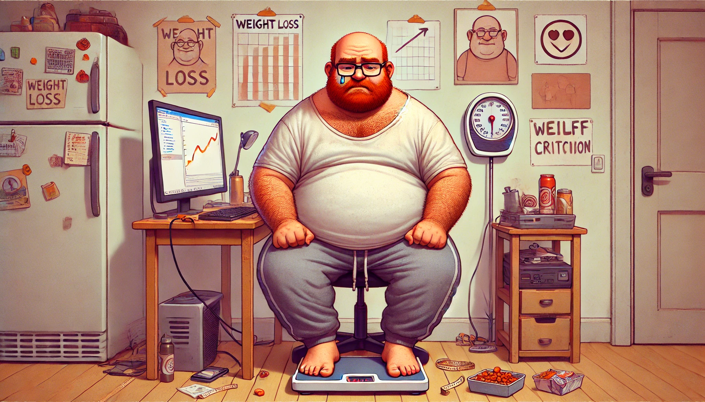

# Libra Weight Fetcher

Keep track of how fat I am, since that helps me moderate my food intake.

## Tech

- Bun, TypeScript (go compiler version)
- SolidJS, UnoCSS for styling
- GitHub actions to fetch weight data and build JSON
- Cloudflare pages to serve static files
- ECharts (and echarts-solid wrapper) to visualize weight data
- [Libra APP API](https://libra-app.eu)
- Withings scale and API as source of weight data.

### Tests and lints

The test suite is run using `bun run test` _not_ `bun run`.

Type-checking can be done by running `tsgo`.

Tests, type-checking and linting can be done in a single command `just check`.

### Code style

Pure logic is put into pure functions that are tested.

TypeScript `any` or `unknowns` types are to be avoided, type redefinitions are
to be avoided and instead we refer to existing types.
